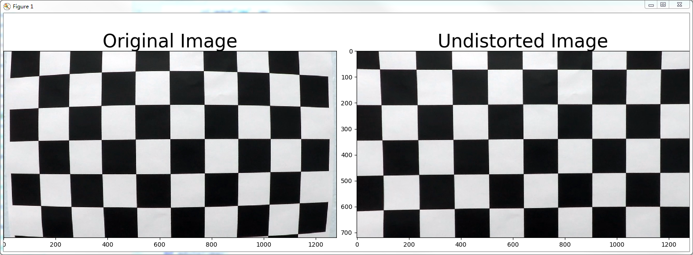
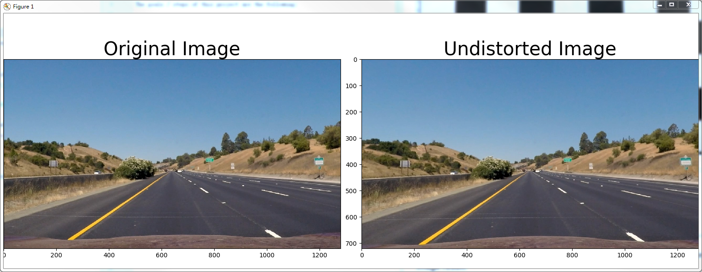
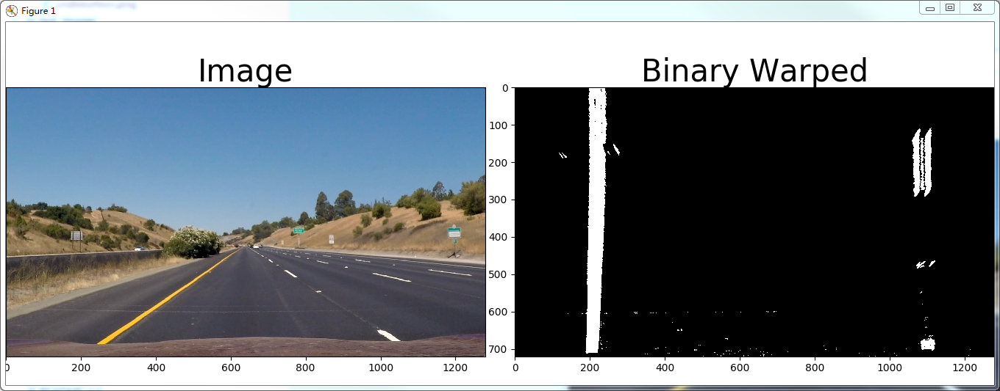
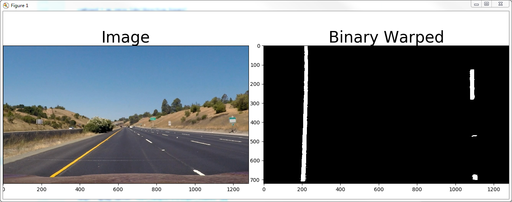
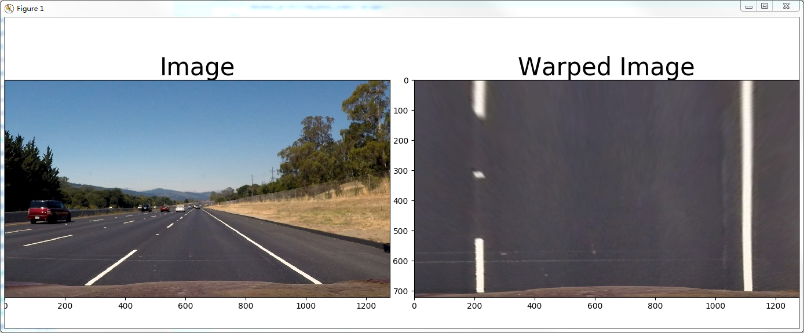
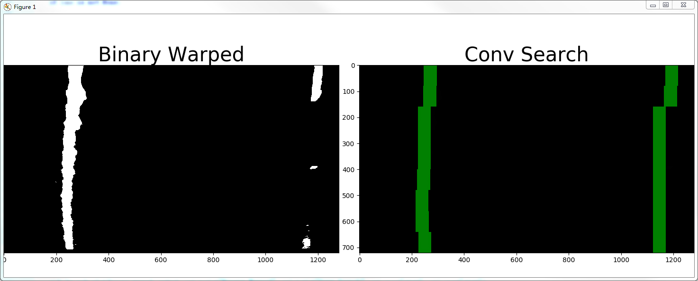
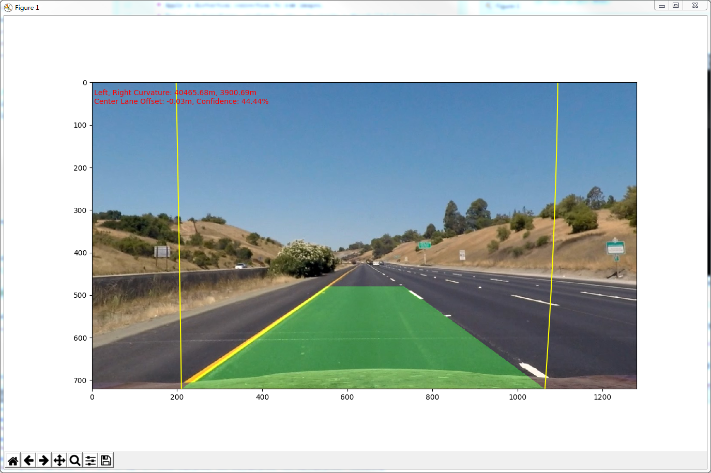

**Advanced Lane Finding Project**

The goals / steps of this project are the following:

* Compute the camera calibration matrix and distortion coefficients given a set of chessboard images.
* Apply a distortion correction to raw images.
* Use color transforms, gradients, etc., to create a thresholded binary image.
* Apply a perspective transform to rectify binary image ("birds-eye view").
* Detect lane pixels and fit to find the lane boundary.
* Determine the curvature of the lane and vehicle position with respect to center.
* Warp the detected lane boundaries back onto the original image.
* Output visual display of the lane boundaries and numerical estimation of lane curvature and vehicle position.

## [Rubric](https://review.udacity.com/#!/rubrics/571/view) Points

### Here I will consider the rubric points individually and describe how I addressed each point in my implementation.  

---

### Camera Calibration

#### 1. Briefly state how you computed the camera matrix and distortion coefficients. Provide an example of a distortion corrected calibration image.

The code for this step is contained in the function `calibrate` of calibration.py(in lines 8 through 36).  

I start by preparing "object points", which will be the (x, y, z) coordinates of the chessboard corners in the world. 
Here I am assuming the chessboard is fixed on the (x, y) plane at z=0, such that the object points are the same for each calibration image.  
Thus, `object_point` is just a replicated array of coordinates, and `object_points` will be appended with a copy of it every time I successfully detect all chessboard corners in a test image.  
`image_points` will be appended with the (x, y) pixel position of each of the corners in the image plane with each successful chessboard detection.  

I then used the output `object_points` and `image_points` to compute the camera calibration and distortion coefficients using the `cv2.calibrateCamera()` function.  
I applied this distortion correction to the test image using the `cv2.undistort()` function(implemented as `undistort` method in calibration.py) and obtained this result: 




### Pipeline (single images)

#### 1. Provide an example of a distortion-corrected image.

To demonstrate this step, I will describe how I apply the distortion correction to one of the test images like this one:



#### 2. Describe how (and identify where in your code) you used color transforms, gradients or other methods to create a thresholded binary image.  Provide an example of a binary image result.

I used a combination of color and gradient thresholds to generate a binary image (the thresholding method `threshold_image` at lines 149 through 162 in `threshold.py`).   

An example of thresholding image by Saturation channel and Sobel X filtering:



An example of thresholding image by Saturation and Red channel:



I experimented with various thresholding combinations. 
And eventually with a combination of Saturation channel thresholding (170, 255) or Red channel thresholding (220, 255) gave quite clean output.

#### 3. Describe how (and identify where in your code) you performed a perspective transform and provide an example of a transformed image.

The code for my perspective transform includes a function called `warp()`, 
which appears in lines 32 through 57 in the file `perspective_transform.py`  
I utilised cv2.warpPerspective with hardcoded source and destination points to image to create a "birds-eye view" road.

```python
width, height = image.shape[1], image.shape[0]

    middle_x = width//2
    top_y = 2*height//3
    top_half_lane = 93
    bottom_half_lane = 450

    src = np.float32([
        (middle_x-top_half_lane, top_y),
        (middle_x+top_half_lane, top_y),
        (middle_x+bottom_half_lane, height),
        (middle_x-bottom_half_lane, height)
    ])
    dst = np.float32([
        (middle_x-bottom_half_lane, 0),
        (middle_x+bottom_half_lane, 0),
        (middle_x+bottom_half_lane, height),
        (middle_x-bottom_half_lane, height)
    ])
```

This resulted in the following source and destination points:

| Source        | Destination   | 
|:-------------:|:-------------:| 
| 547, 480      | 190, 0        | 
| 733, 480      | 1090, 0       |
| 1090, 720     | 1090, 720     |
| 190, 720      | 190, 720      |

I verified that my perspective transform was working as expected by verifying that the lines appeared parallel in the warped image.



#### 4. Describe how (and identify where in your code) you identified lane-line pixels and fit their positions with a polynomial?

I chose convolution window search approach to find strong signals for left and right lanes. 
I broke image into 18 vertical layers by setting convolution window height to 40(8 = 720/40). The search was divided into two scenarios.

* The function `find_lane` in `convolution.py` file(through line 70 to 93) was used when we search from scratch.
I convolved a window onto a layer of summed image to find the left and right lane centroids.
I then did some checks to make sure the signals are valid, e.g., strength of signals and whether the distance of left to right centroids matches roughly with lane width.

* The `find_lane_with_hint`(through line 126 to 155) was used when we had left and right centroids from previous search. 
Based on the controids from previous search, we only search `previous controids +/- 100 pixels` for current centroids, which accelerated the search.
There were some unexpected scenarios handlings afterwards. I only accepted controids when the signals were strong enough, otherwise, I would use the previous values.
I also added found lane confidence level, which would help lane selection in video processing.

Once a set of left and right centroids were identified, we could use these points to fit second order polynomial, 
which was implemented in the method `polyfit` of `Lane` class in `convolution.py`(line through 26 to 30).



#### 5. Describe how (and identify where in your code) you calculated the radius of curvature of the lane and the position of the vehicle with respect to center.
The radius of curvature of the line was calculated using warped image(from birds-eye-view). 
The horizonal and vertical pixel values were mapped into real world meter values by given conversions.

The vehicle offset from the center was calculated by image center substracting lane center, which was based on the assumption of the camera mounted at the center of the car.
The resulted offset value was mapped to real world meter value by given conversions. 

The two measurements were done through the functions `Lane.measure_curvature` and `Convolution.center_offset` in lines 32 to 48 and lines 176 to 182 respectively in my code file `convolution.py`.

#### 6. Provide an example image of your result plotted back down onto the road such that the lane area is identified clearly.

I plotted green polygon in lane line area in warped space and project back to image space. I implemented this step through the function `Convolution.draw_lane` in lines 157 through 174 in my code in `convolution.py`.  
Here is an example of my result on a test image:



---

### Pipeline (video)

#### 1. Provide a link to your final video output.  Your pipeline should perform reasonably well on the entire project video (wobbly lines are ok but no catastrophic failures that would cause the car to drive off the road!).

Here's a [link to my video result](./project_video_processed.mp4)

---

### Discussion

#### 1. Briefly discuss any problems / issues you faced in your implementation of this project.  Where will your pipeline likely fail?  What could you do to make it more robust?
Along with the approach discribed above, I finally added some optimisations, which were averaging over 5 recent lanes, last good lane and some lane selection statistics.
Except for one or two breaks, the whole pipeline worked reasonably well for the most of video frames. 
The course was quite time-consuming, especially image thresholding and finally whole pipeline fine tuning. If I have more time, I will look into the following areas.

* Experimenting more combinations for image thresholding, as it is critial for lane line search. 
At the moment the line search is not good enough. I reduced good lane confidence to 0.2(It is a measurement I calculated to help optimisation. The value ranges from 0 to 1).
* With the help of the statistics I added in the class `Line` in file project.py, I may be able to make lane detection more smooth with more time, by turning everaging and lane confidence.
* Perspective transformed road lanes are not 100% parallel. If possible, I would like to use an algorithm instead of hardcoding coordinates.
* I have not been able to try with challenge video. I would expect the image thresholding may not work well with them.

